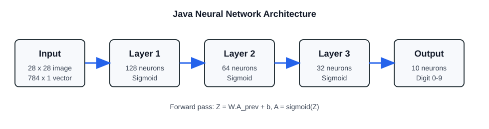
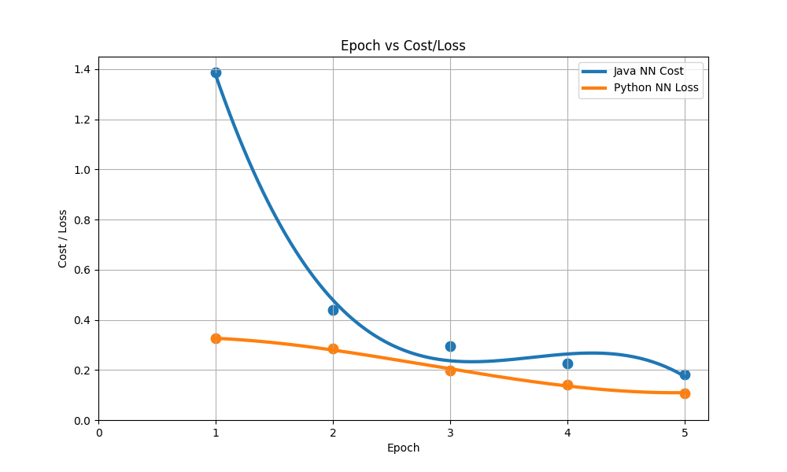
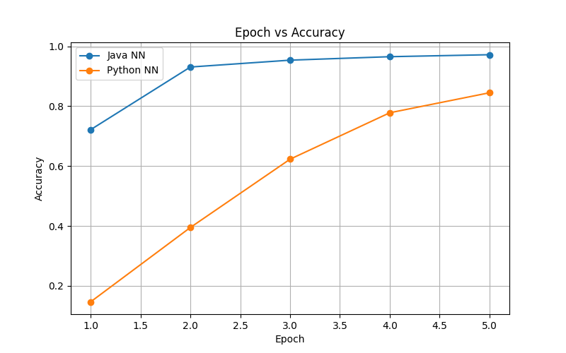
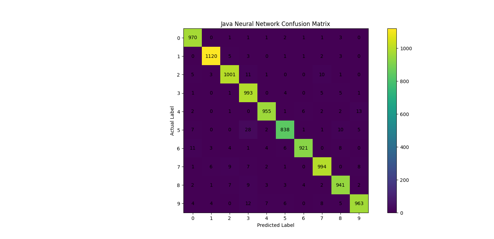

# Java Neural Network on MNIST

This project implements a simple feed-forward neural network in Java for MNIST digit classification. The model is built from scratch using custom matrix operations, Xavier weight initialization, sigmoid activations, binary cross-entropy loss, and manual backpropagation.

## Model Architecture

| Layer | Size | Activation |
|---|---:|---|
| Input | 784 | - |
| Hidden 1 | 128 | Sigmoid |
| Hidden 2 | 64 | Sigmoid |
| Hidden 3 | 32 | Sigmoid |
| Output | 10 | Sigmoid |

## Training Curves

### Epoch vs Cost/Loss

### Epoch vs Accuracy

## Java Model Evaluation

The Java neural network achieved **96.96%** accuracy on the MNIST test set.

## Per-Class Metrics

| Digit | TP | FP | TN | FN | Precision | Recall | F1-score |
|---:|---:|---:|---:|---:|---:|---:|---:|
| 0 | 970 | 33 | 8987 | 10 | 0.9671 | 0.9898 | 0.9783 |
| 1 | 1120 | 17 | 8848 | 15 | 0.9850 | 0.9868 | 0.9859 |
| 2 | 1001 | 28 | 8940 | 31 | 0.9728 | 0.9700 | 0.9714 |
| 3 | 993 | 72 | 8918 | 17 | 0.9324 | 0.9832 | 0.9571 |
| 4 | 955 | 20 | 8998 | 27 | 0.9795 | 0.9725 | 0.9760 |
| 5 | 838 | 24 | 9084 | 54 | 0.9722 | 0.9395 | 0.9555 |
| 6 | 921 | 13 | 9029 | 37 | 0.9861 | 0.9614 | 0.9736 |
| 7 | 994 | 31 | 8941 | 34 | 0.9698 | 0.9669 | 0.9683 |
| 8 | 941 | 37 | 8989 | 33 | 0.9622 | 0.9661 | 0.9641 |
| 9 | 963 | 29 | 8962 | 46 | 0.9708 | 0.9544 | 0.9625 |

## Notes

- Rows in the confusion matrix represent actual labels.
- Columns in the confusion matrix represent predicted labels.
- TP, FP, TN, and FN are calculated one digit at a time using a one-vs-rest interpretation.
